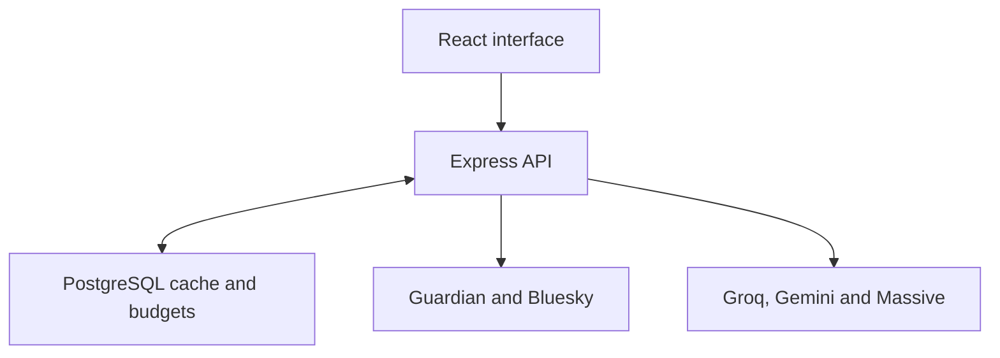

# FirstBrief

**Catch up on the news—and understand why it matters.**

FirstBrief is a personal news dashboard that combines live reporting, AI-assisted explanations, and selected social discussion in one reading experience.

**[Open FirstBrief →](https://firstbrief.fyi)**

## Why I built it

Keeping up with the news often means moving between headlines, long articles, social feeds, and financial information. I built FirstBrief to explore a simpler experience: start with a story, get a concise rundown, and choose the additional context you want.

This project brings together my interests in product development, engineering, and applied AI. It is a working MVP and an ongoing learning project.

## My role and development approach

I defined the product concept, prioritized features, and iterated on the reading experience using AI-assisted development in Replit. I used AI tools to help implement and troubleshoot the application while directing requirements and reviewing behavior through repeated testing.

The build progressed from a visual prototype to live news, article-level explanations, social discussion, and market context. A recurring challenge was balancing useful analysis with limited API quotas, which shaped the on-demand generation, caching, and fallback behavior.

## What it does

| Feature | Purpose |
| --- | --- |
| Live news feed | Browse reporting from The Guardian across topics, with links to the original coverage. |
| The Rundown | Get a concise introduction to a story before exploring further. |
| Why It Matters | Request an AI-generated explanation of the story's significance. |
| AI Outline | Request a brief summary of a selected article's main angle and takeaway, based on available source excerpts. |
| Public Sentiment | Explore relevant Bluesky discussion, with evidence links and limited-sample states. |
| Market Context | Explore company and market information when a story has a supported connection to a publicly traded company. |

Analysis availability depends on source coverage, provider availability, and usage limits. The current news feed uses The Guardian; a broader publisher offering is a future direction.

## How it works

The React interface requests news and analysis through an Express API. The backend retrieves publisher content and calls external services when needed. Shared PostgreSQL storage lets visitors reuse valid analysis results instead of generating the same answer repeatedly.



### Engineering decisions

- **Generate analysis on demand.** Readers choose when to request additional analysis, helping control unnecessary provider calls.
- **Reuse results across visitors.** Shared caching and coordination reduce duplicate work for the same article.
- **Bound AI usage.** Request budgets, timeouts, and provider cooldowns help manage API limits.
- **Make missing evidence visible.** A failed social search or a small sample should not be presented as a confident measure of public opinion.
- **Keep provider credentials on the server.** The browser calls application endpoints rather than receiving API keys.

## Technology

| Layer | Tools |
| --- | --- |
| Frontend | React, TypeScript, Vite, Tailwind CSS, TanStack Query |
| Backend | Node.js, Express 5, TypeScript |
| Database | PostgreSQL, Drizzle ORM |
| API contracts | OpenAPI, Orval, Zod |
| News | The Guardian Open Platform |
| AI analysis | Groq; Google Gemini for company resolution |
| Social discussion | Bluesky |
| Market data | Massive |
| Workspace and hosting | pnpm workspaces, Replit |

## Repository guide

| Path | Contents |
| --- | --- |
| `artifacts/firstbrief/` | Main web interface and frontend tests |
| `artifacts/api-server/` | News routes, analysis services, provider controls, and backend tests |
| `lib/db/` | Database connection and schemas for analysis results and budgets |
| `lib/api-spec/` | API specification and code generation |
| `lib/api-zod/` | Shared validation and analysis contracts |
| `lib/api-client-react/` | Generated React API client |

## Development

The current application is configured for Replit with Node.js 24, pnpm, and PostgreSQL. A portable local setup is still a work in progress.

### Configuration

Provide these values through your runtime environment or Replit Secrets. Never commit credentials.

| Variable | Used for |
| --- | --- |
| `DATABASE_URL` | PostgreSQL connection |
| `SESSION_SECRET` | Visitor identity signing for shared analysis controls |
| `GUARDIAN_API_KEY` | Live news retrieval |
| `GROQ_API_KEY` | Core AI analysis |
| `GEMINI_API_KEY` | Company resolution for market context |
| `MASSIVE_API_KEY` | Market data |
| `PORT` | Listening port for each running service |
| `BASE_PATH` | Frontend base path, such as `/` |

Provider accounts and applicable access permissions are required for their respective features. A local `.env` file is not automatically loaded by every command in this repository.

### Workspace commands

```bash
# Install dependencies
pnpm install

# Apply the schema to a development database (requires DATABASE_URL)
pnpm --filter @workspace/db run push

# Run the API and frontend in separate terminals
pnpm --filter @workspace/api-server run dev
pnpm --filter @workspace/firstbrief run dev

# Type checking and build
pnpm run typecheck
pnpm run build
```

**Local setup note:** Each service needs its own `PORT`; the frontend also needs `BASE_PATH`. Outside Replit, configure a proxy to route `/api` from the frontend origin to the API service. The current Vite configuration does not supply this proxy, and Express does not serve the built frontend. These commands are a workspace reference, not a complete standalone deployment guide.

Test files live in `artifacts/api-server/tests/` and `artifacts/firstbrief/tests/`, covering feed handling, editorial selection, provider behavior, and shared analysis.

## Current limitations

- AI explanations can be incomplete or incorrect. Original reporting remains the source to consult.
- Bluesky results reflect a selected sample of one platform, not representative public opinion.
- Market context is informational. It does not predict prices or establish that an article caused a market movement; company matching and data coverage can be incomplete.
- External API quotas and outages can make individual features unavailable.
- Hosting and development configuration currently depend on Replit conventions.
- News, images, social posts, and market data remain subject to their providers' rights and terms. This repository does not grant rights to redistribute those materials.

## Next steps

- Improve local setup and document a reproducible deployment outside Replit.
- Gather feedback on whether the briefing helps readers understand stories faster.
- Improve coverage, evidence quality, and handling of unavailable analysis.
- Explore additional news sources with appropriate permissions.

## Author

Built by **Ro Puente**, a Mechanical Engineering student at the University of Colorado Boulder exploring product development and applied AI.

Feedback and bug reports are welcome through GitHub Issues. For a bug report, include the page, expected behavior, and what happened; omit API keys and other private information.
